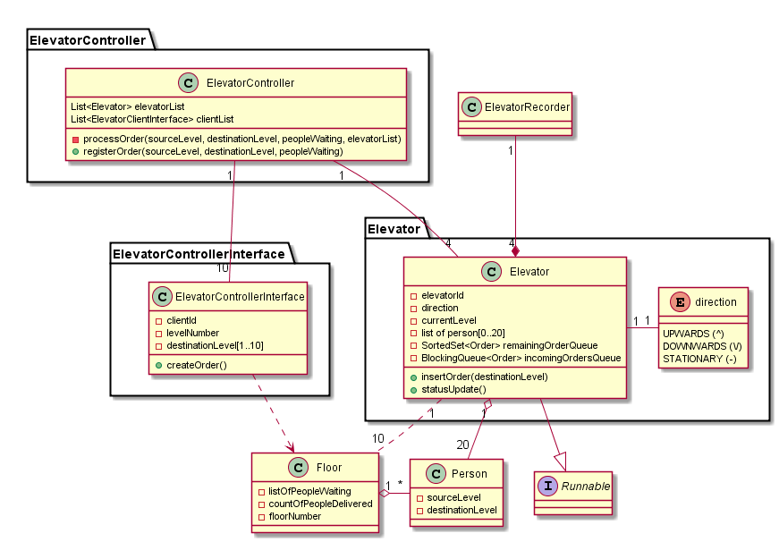

Introdution
===========

An elevator system

# Original Requirements

* An elevator system with a web frontend and backend storage system

* The gui should cater for 4 elevators (numbered A,B,C and D) and 10 floors

* Each elevator should not take on more than 20 people at a time

* People on a certain floor (for example, Level 9) should get the nearest available elevator 
  (eg, say 3 elevators {A,B,C} are on floor 1 and the fourth {D} is on level 10 then elevator D should travel to get the people on level 9)

* The gui should show each level and the number of people who wish to enter an elevator (textbox)

*	Each level should have dropdown menu and button beside it to represent the level / floor that the people on the said level wish to travel to

* On each level there should be another 4 columns which show each elevator status.
  That is, the number of people in the current elevator and whether it’s going up (^) down (\/) or stationary (-)

* Track the elevator movement in backend data storage of your choice.

# Extended Requirements/Assumptions

* The below assumption are made to clarify the requirements and are specifically considered to be not in conflict with the original requirements

* Each floor has a single button board to call elevator. 

* All people on one floor must go to the same destination floor, i.e. all people on level 3, will be taken to level 9

* At a given time, on a given floor, only one button can be pressed by the people on that floor.

* An elevator may stop between floors iff, there are people who want to get off the elevator, or there are people 
who want to get on the elevator(provided elevator is not full)

* The elevator will stop if there are no more orders for it to visit.

* If there are more people on a floor than can fit it in the elevator, then the elevator takes the people that can fit in the elevator leaving behind extra people on the floor

* People can not use the elevator to go on the same floor as they are already on

* The elevator selection algorithm depends on direction of elevator and the distance from the destination floor. 
In essence, an elevator going upwards will not take any orders for any floor below it unless it is on the last floor in that direction.
An elevator going upwards will only take the orders for the floor it has not reached yet(in upward direction). 
Same rule applies for the elevator going downwards

* In case of tie in elevator selection(for two stationary elevators), a randomly selected elevator will be used to service the people.

* An elevator will only stop on a floor if it has an order to stop on that floor.

* Destination floor can not be changed by people inside the elevator, it is only selected at the time of boarding the elevator.

* Elevator will stop on floors in order of their occurrence.

# Design notes

* The elevator system is composed of Elevator-Controller and a set Elevators

* Each floor has a switch board that is used by people to interact with elevator system.

* When a button is pressed, Elevator-Controller adds a new order in the nearest Elevator order-list.

* An Elevator places the orders received from Elevator-Controller in sorted manner.

* Elevators notify Elevator-Controller for every floor they reach.

* Elevator-Controller keeps records of Elevator location and direction at all times. A stationary Elevator will not have any direction.

# Documentation

## Use case diagram

## Component Diagram

## Class Diagram

