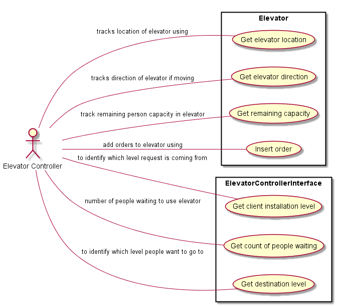
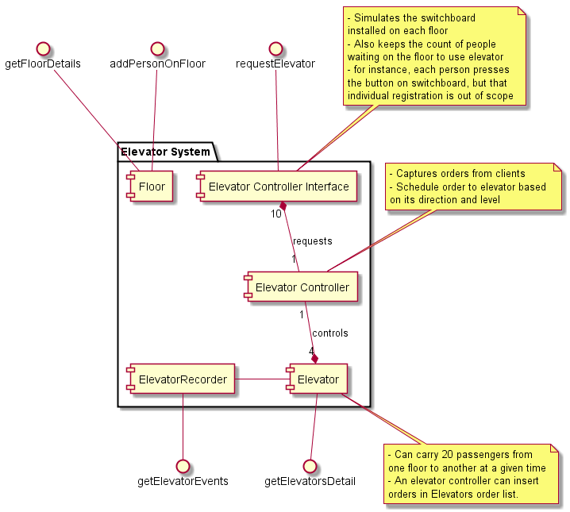

# Introdution

This is a very basic implementation of an elevator system.

# Installation

1. Get latest copy of the code using `git clone https://github.com/nabsha/ascender.git`
2. Compile it using `cd ascender && mvn clean install` 
3. Run it using `mvn exec:java`

# Usage

Once the application is running it will exposes following REST endpoints to interact with the elevator system

* [GET /api/floors](http://localhost:4567/api/floors) :
This api returns the Persons waiting on each floor and count of Persons delivered to each floor

* [GET /api/elevators](http://localhost:4567/api/elevators) : 
This api returns model of all elevators in the system

* [POST /api/addPeopleOnFloor](http://localhost:4567/api/addPeopleOnFloor) : 
This api adds people on a the given floor using POST method. It expects three fields in the form which are floorNumber, peopleCount and destinationFloor
The form body must be encoded as "x-www-form-urlencoded"

* [GET /api/requestElevator/[floorNumber]](http://localhost:4567/api/requestElevator/1) : 
This api submits a request to ElevatorController to use the elevator. The ElevatorController in turn selects an appropriate Elevator and add an Order in Elevator order list
The floorNumber must be replaced with the source floor creating the request.
* [GET /api/events](http://localhost:4567/api/events) :
This api prints all the tracked movement of the Elevator

# How it works
A simple scenario is that people come to a floor(addPeopleOnFloor) and request elevator for the destination floor(requestElevator). 
Once Elevator stops at a floor, people get off the elevator first, then people waiting on this floor get on the elevator and Order for new floor and this goes on.
To test the system, one can use a REST client like PostMan for Chrome, that can hit above mentioned endpoints.

## 1. Thats hows to add people on a floor, notice the fields 

## 2. Then to request the elevator

## 3. Check the elevators status

## 4. Check Floor status

## 5. Tracking events generated by Elevator movement

## Elevator Scheduling and Next Stop Algorithm
In this implementation there are two algorithms running in conjunction. 

1. ElevatorController is higher level scheduler that distributes the incoming requests among Elevators. 
This is based on scoring algorithm that calculates score for each Elevator based on a formula (ElevatorController.selectElevator()) and the Elevator with lowest score is selected.

2. Once Elevator recieves an Order, it keeps its own sorted set of next destination to visit and selects the first Order in a specified Direction(Elevator.checkNextStop()). 
i.e. an elevator going up will prioritize Orders in upward direction and vice versa.

# Technologies
Following technologies are used in this project

* Java 8
* Spark Java
* Hibernate
* HSQLDB
* Maven

# Original Requirements

* An elevator system with a web frontend and backend storage system

* The gui should cater for 4 elevators (numbered A,B,C and D) and 10 floors

* Each elevator should not take on more than 20 people at a time

* People on a certain floor (for example, Level 9) should get the nearest available elevator 
  (eg, say 3 elevators {A,B,C} are on floor 1 and the fourth {D} is on level 10 then elevator D should travel to get the people on level 9)

* The gui should show each level and the number of people who wish to enter an elevator (textbox)

*	Each level should have dropdown menu and button beside it to represent the level / floor that the people on the said level wish to travel to

* On each level there should be another 4 columns which show each elevator status.
  That is, the number of people in the current elevator and whether it’s going up (^) down (\/) or stationary (-)

* Track the elevator movement in backend data storage of your choice.

# Extended Requirements/Assumptions

* The below assumption are made to clarify the requirements and are specifically considered to be not in conflict with the original requirements

* Each floor has a single button board to call elevator. 

* All people on one floor must go to the same destination floor, i.e. all people on level 3, will be taken to level 9

* At a given time, on a given floor, only one button can be pressed by the people on that floor.

* An elevator may stop between floors iff, there are people who want to get off the elevator, or there are people 
who want to get on the elevator(provided elevator is not full)

* The elevator will stop if there are no more orders for it to visit.

* If there are more people on a floor than can fit it in the elevator, then the elevator takes the people that can fit in the elevator leaving behind extra people on the floor

* People can not use the elevator to go on the same floor as they are already on

* The elevator selection algorithm depends on direction of elevator and the distance from the destination floor. 
In essence, an elevator going upwards will not take any orders for any floor below it unless it is on the last floor in that direction.
An elevator going upwards will only take the orders for the floor it has not reached yet(in upward direction). 
Same rule applies for the elevator going downwards

* In case of tie in elevator selection(for two stationary elevators), a randomly selected elevator will be used to service the people.

* An elevator will only stop on a floor if it has an order to stop on that floor.

* Destination floor can not be changed by people inside the elevator, it is only selected at the time of boarding the elevator.

* Elevator will stop on all floors for which it has received orders, in order of their occurrence(i.e. upwards/downwards) for 5 sec only. 
Elevator will not stop on floor/level without any order for it.

* Elevator will take 1 sec to move between 1 floor to next floor in any direction

# Design notes

* The elevator system is composed of Elevator-Controller and a set Elevators

* Each floor has a switch board that is used by people to interact with elevator system.

* When a button is pressed, Elevator-Controller adds a new order in the nearest Elevator order-list.

* An Elevator places the orders received from Elevator-Controller in sorted manner.

* Elevators notify Elevator-Controller for every floor they reach.

* Elevator-Controller keeps records of Elevator location and direction at all times. A stationary Elevator will not have any direction.

* Elevator will keep track of people and their destination level. So lets say 10 people board the elevator from ground floor 
going to floor 10, then on its way up, 5 more people boarded the elevator from floor 2 for floor 9, then elevator must 
stop at floor 9, remove 5 people from itself, then go to floor 10 and remove 10 people.

# Documentation

## Use case diagram

## Component Diagram

## Class Diagram

